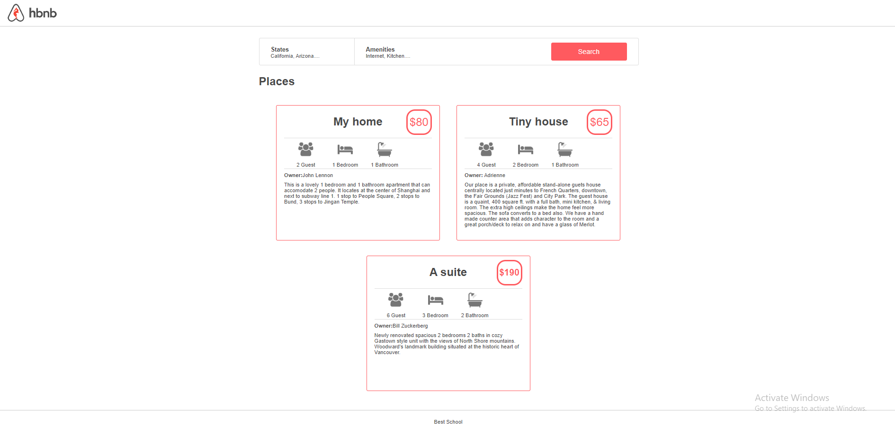

# Table of Contents

- Introduction
- Project Structure
- Features
- Dependencies

# Introduction

Welcome to the AirBnB Clone Web Application! This project is designed to replicate the basic structure and design of the popular AirBnB website.

# Project Structure

## The project is organized into different sections:

- Header: The header section provides the main navigation for users to explore the website.

- Footer: The footer section contains information about the organization or school associated with the project.

# Features

- Detailed Information: Each place includes detailed information such as price, guest capacity, rooms, bathrooms, owner details, and a description.

- Responsive Design: The application is designed to be responsive, ensuring a seamless experience across different devices.

# Dependencies

## The project utilizes the following dependencies:

- CSS Stylesheets: Common styles, header styles, footer styles, filters styles, and specific styles for places.

- Images: Icon images for groups, beds, and bathrooms.
